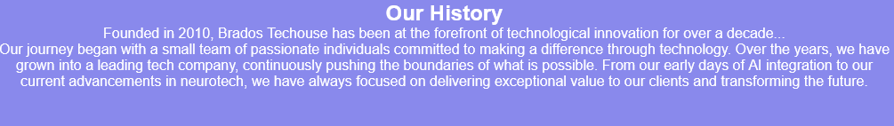
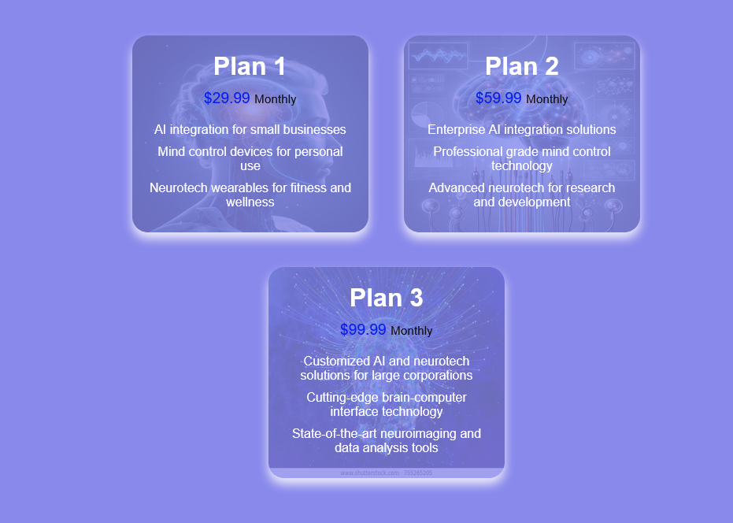

#  BRADOS 
Welcome to the future of minds! [Brados ](https://paula2416.github.io/BRADOS-T/)

 * Brados is a club that brings your thoughts to life, premiering destination for the innovative technology solutions of mind control, ai integration, and neurotech. With a change for the future, we make life more creative and innovative with our
 minds.
 # Our site 
 
  # Existing Features

## Navigation bar
Here is a full responsive navigation bar including links to the Logo, Home page, About Us and Sign Up page and is identical in each page to allow easy navigation through the website. This section will allow the user to easily navigate from page to page across all devices without having to revert back to the previous page using the back button.
 

 # HOME PAGE
 ## Destination page

The destination page includes a photograph with text overlay to welcome the user with a belief introduction about the Club. This page is to mostly introduce the user with the Technology image at the background and the heading to the life changing club Brados.

## Our vision

At Brados , our vision as shown in the diagram is mainly to use ai integration, mind control, and neurotech innovation.

 
 ## Our Goal 
At Brados , we are committed to achieving excellence through our core goals. These goals guide our efforts to deliver exceptional value and drive positive change to the future .

* Innovation
* User-Centric Design
* Sustainability
* Collaboration
* Community Engagement:
      
These goals are integral to our mission at Brados, guiding our work and helping us achieve our vision of creating a better, more technologically advanced world.

# ABOUT US PAGE

## Our Team

Meet the brilliant minds behind Brados . Our team is composed of dedicated professionals who are passionate about technology and innovation. Together, we strive to push the boundaries of what’s possible and deliver cutting-edge solutions to our clients and users.

* John Doe (CEO & Founder)
* Janef Smith (CTO)
* Emily Johnson (COO)
 

## History

 Our journey began with a small team of passionate individuals committed to making a difference through technology. Over the years, we have grown into a leading tech company, continuously pushing the boundaries of what is possible. From our early days of AI integration to our current advancements in neurotech, we have always focused on delivering exceptional value to our clients and transforming the future.
  

## Pricing
 Pricing section of the Brados  website outlines the main elements and their purposes, helping maintain and update the website content effectively. howcases the subscription plans offered by Brados, detailing their features and monthly costs.
* Plan 1
* Plan 2
* Plan 3
  

        
  # SIGNUP PAGE
 This page will allow the user to get signed up to Brados Techouse to start their journey part in road to future Thoughts. The user will be asked to submit their name email address and a password.

## footer section
HTML structure for the footer section of the Brados Techouse is detailed with the main elements and their purposes, ensuring the footer is easy.

The footer section is divided into several parts to organize the content effectively: Footer Left, Footer Center, Footer Right, Footer Bottom, and Social Media Icons.

## Confirmation page
This page is opened when one signup successfully 

#  Functional Testing 

| Action                                       |Expected  Behaviour            | Pass/Fail|
| -------------------------------------------| --------------------------      | ---------|
|Open URL link                               | Loads Home page                 |  Pass    |  
|Tap the about us link in the navigation bar | Loads About Us page             | Pass      |
|Tap the sign up link in the navigation bar  | Loads Sign Up page              |  Pass     |
|Tap the sign up today link in the index.html| loads the Sign up page          | Pass     |
|Sign up in the sign up page                 | Loads the confirmation.html     |  Pass     |
|Tap the facebook link in the footer         | Loads to facebook signup page   |  Pass    |
|Tap the instagram link in the footer        | loads to instagram signup page  |  Pass     |
|Tap the twiiter link in the footer          | Loads to twitter signup page    | Pass    |

# Testing 
  * i tested this page and it works in the different websites that is to say :Chrome ,Safari , Google and Firebox .
  * i tested this website and i confirmed that i is responsive and looks good on all sizes and platforms.
  * i tested all the links and confirmed that they work and lead oto there designed pages .

  # bugs 
  #### index.html
  *  When i ran my index.html code in the W3C validator ,Section lacked heading,
  i was explained to my the W3C to consider using h2-h6 elements to add identifying headings to all sections, or else use a div element instead for any cases where no heading is needed.
  ---i add a div to he index.html

  *  i also discovered that using 'h1' headings is for top level heading only and i did not change because i considered the h1 at line 32 column 17 to line 32 column 20 as a top-level heading . 

#### aboutus.html and signup.html
i tested the aboutus.html and signup.html in the code validator which gave an error ; Style sheets should not include HTML syntax.

From line 1, column 1; to line 1, column 15 and  line 154, column 8
* There was a start tag error which i fixed by adding the <!DOCTYPE html>

* The form tag was closed yet there were open elements which i solved by losing the open tags
 

# unfixed bugs
The bug below appeared when i was final testing my html and i could not fix it  

  

 # Validator Testing

   * HTML
    No errors were returned when passing through the official W3C validator
   * CSS
    No errors were found when passing through the official (Jigsaw) validator
  * Performance
   i also identified that my colors and fonts for all pages are well accessed by running each page in the light house.
 
 
  ## Deployment 
  I deplyed this site to Github pages ,following the steps; 
  * open the Github respository and navigate to the settings tap 
  * from the source section drop-down menu ,seect the master branch 
  * once the master branch has been selected ,the page provided the link to the completed website
   # NB 
   ## CREDITS
    * The steps followed to deploy were got from
https://learn.codeinstitute.net
   
 ### media 
 * all the images were taken from https://www.pinterest.com/

