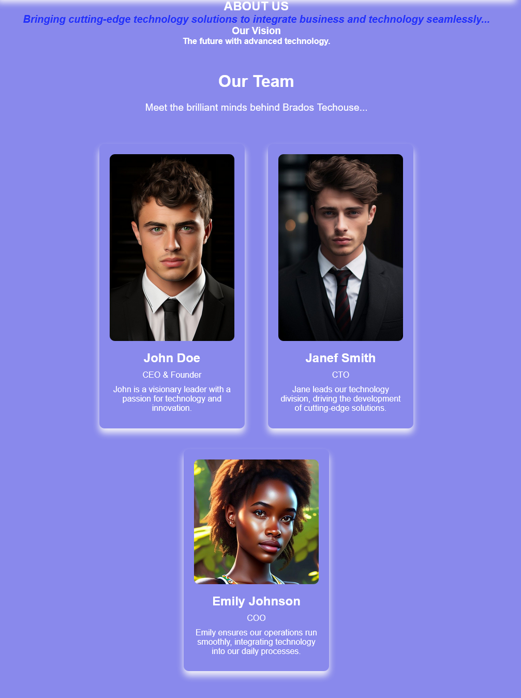

# THE BRADOS TECHOUSE
Welcome to the future of minds! [Brados Techouse](https://paula2416.github.io/BRADOS-T/)

Brados Techouse is a club that brings your thoughts to life, premiering destinys for the innovative technology solutions of mind control,ai intergration and neurotech .With a change for the future, we make life more creative and innovative with our
 minds.
 # Our site 
 
  # Existing Features

## navigation bar
      Here are full responsive navigation bar including links to the Logo, Home page, About Us and Sign Up page and is identical in each page to allow easy navigation though the website.This section will allow the user to easily navigate from page to page across all devices without having to revert back to the previous page using the back button.
 # navigation bar
 
 # HOME PAGE
 ## Destination page

   The destination page includes a photograph with text overlay to welcome the user with a belief introduction about the Techouse.This page is to mostly introduce the user with the Technology image at the background and the heading one to the life changing club 'Brados Techouse.
# HOME PAGE
## hero image

## Our vision

At Brados Techouse, our vision is to seamlessly integrate advanced AI, mind control, and neurotech innovations into everyday life. We believe that technology should not only be powerful but also intuitive and accessible, empowering individuals and businesses to achieve their full potential.

 
 ## Our Goal 
At Brados Techouse, we are committed to achieving excellence through our core goals. These goals guide our efforts to deliver exceptional value and drive positive change to the future .

 ###   Innovation:
        We strive to stay at the forefront of technological advancements. By continuously pushing the boundaries, we aim to create groundbreaking solutions that revolutionize industries. Our focus on innovation ensures that we can provide our users with cutting-edge products and services that meet the evolving needs of the market.

   ### User-Centric Design:
        Our products and services are developed with the user in mind. We prioritize user experience, ensuring that our technology is accessible, intuitive, and easy to use. By focusing on user-centric design, we aim to make technology a seamless part of everyday life for all our users, regardless of their technical proficiency.

   ### Sustainability:
        We are committed to implementing eco-friendly practices and solutions. Our goal is to minimize our environmental impact and promote sustainability in all aspects of our business. By adopting sustainable practices, we aim to contribute positively to the environment and encourage others in the industry to do the same.

   ### Collaboration:
        We believe in the power of collaboration. By fostering partnerships with industry leaders, academic institutions, and our clients, we drive mutual growth and innovation. Our collaborative approach ensures that we can leverage diverse expertise and perspectives to create superior technological solutions.

   ### Community Engagement:
        Engaging with and giving back to our communities is a core value at Brados Techouse. We actively participate in various initiatives and programs that support and uplift our communities. Through our community engagement efforts, we aim to make a positive impact and contribute to the well-being of society.

These goals are integral to our mission at Brados Techouse, guiding our work and helping us achieve our vision of creating a better, more technologically advanced world.

# ABOUT US PAGE

## Our Team

Meet the brilliant minds behind Brados Techouse. Our team is composed of dedicated professionals who are passionate about technology and innovation. Together, we strive to push the boundaries of what’s possible and deliver cutting-edge solutions to our clients and users.
 ### CEO & Founder
John Doe
John is a visionary leader with a passion for technology and innovation. With a strong background in tech startups, he founded Brados Techouse to create a hub for revolutionary technological advancements. Under his leadership, the company has grown into a leading tech innovator, continuously pushing the boundaries of what’s possible.
 ###  CTO
Janef Smith
 Janef leads our technology division, driving the development of cutting-edge solutions. With extensive experience in AI and neurotechnology, she oversees the creation and implementation of our advanced tech products. Her expertise ensures that Brados Techouse remains at the forefront of technological innovation.
 ### COO
Emily Johnson
 Emily ensures our operations run smoothly, integrating technology into our daily processes. Her operational acumen and strategic planning skills are vital in aligning our technology initiatives with our business goals. Emily’s efforts ensure that our projects are executed efficiently and effectively.

## history
 ### Founded in 2010, Brados Techouse has been at the forefront of technological innovation for over a decade...
            Our journey began with a small team of passionate individuals committed to making a difference through technology. Over the years, we have grown into a leading tech company, continuously pushing the boundaries of what is possible. From our early days of AI integration to our current advancements in neurotech, we have always focused on delivering exceptional value to our clients and transforming the future.

## pricing
 Pricing section of the Brados Techouse website outlines the main elements and their purposes, helping maintain and update the website content effectively. showcases the subscription plans offered by Brados Techouse, detailing their features and monthly costs.
### Plan 1
  $29.99 Monthly cost with the billing period,features included in Plan 1 are; AI integration for small businesses,Mind control devices for personal use and Neurotech wearables for fitness and wellness
 ### Plan 2
  $59.99 Monthly cost with the billing period,features included in plan 2 are; Enterprise AI integration solutions ,Professional grade mind control technology and Advanced neurotech for research and development
  
  
        
  # sign up page
        This page will allow the user to get signed up to Brados Techouse to start their journey part in road to future Thoughts. The user will be asked to submit their name email address and a password.

## footer section
HTML structure for the footer section of the Brados Techouse is detailed with the main elements and their purposes, ensuring the footer is easy.

The footer section is divided into several parts to organize the content effectively: Footer Left, Footer Center, Footer Right, Footer Bottom, and Social Media Icons.

